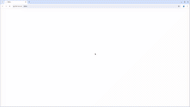


# Демопроект. Автоматизация тестирования.  [Пиццерии «Пицца Темпо»](https://www.pizzatempo.by/)

> Пицца Темпо – крупнейшая сеть пиццерий в Республике Беларусь

## **Содержание:**
____

* <a href="#tools">Технологии и инструменты</a>

* <a href="#cases">Примеры автоматизированных тест-кейсов</a>

* <a href="#jenkins">Сборка в Jenkins</a>

* <a href="#console">Запуск из терминала</a>

* <a href="#allure">Allure отчет</a>

* <a href="#allure-testops">Интеграция с Allure TestOps</a>

* <a href="#jira">Интеграция с Jira</a>

* <a href="#telegram">Уведомление в Telegram при помощи бота</a>

* <a href="#video">Примеры видео выполнения тестов на Selenoid</a>
____
<a id="tools"></a>
## <a name="Технологии и инструменты">**Технологии и инструменты:**</a>

<p align="center">  
<a href="https://www.jetbrains.com/idea/"></a>  
<a href="https://www.java.com/"></a>  
<a href="https://github.com/"></a>  
<a href="https://junit.org/junit5/"></a>  
<a href="https://gradle.org/"></a>  
<a href="https://selenide.org/"></a>  
<a href="https://aerokube.com/selenoid/"></a>  
<a href="ht[images](images)tps://github.com/allure-framework/allure2"></a> 
<a href="https://qameta.io/"></a>   
<a href="https://www.jenkins.io/"></a>  
<a href="https://www.atlassian.com/ru/software/jira/"></a>  
</p>

____
<a id="cases"></a>
## <a name="Примеры автоматизированных тест-кейсов">**Примеры автоматизированных тест-кейсов:**</a>
____
-  *Проверка доступности главной страницы*
-  *Проверка доступности страницы регистрации*
-  *Проверка наличия короткого номера*
-  *Проверка доступности окна выбора города*
-  *Проверка возможности добавить 'Акция "Тройка"' из раздела 'Акции' в корзину*


____
<a id="jenkins"></a>
## </a><a name="Сборка"></a>Сборка в [Jenkins](https://jenkins.autotests.cloud/job/vplatonov-TempoPizza)</a>
____
<p align="center">  
</a>  
</p>


### **Параметры сборки в Jenkins:**

- *browser (браузер, по умолчанию chrome)*
- *browserSize (размер окна браузера, по умолчанию 1920x1080)*
- *baseUrl (адрес тестируемого веб-сайта)*
- *remoteUrl (логин, пароль и адрес удаленного сервера Selenoid)*

<a id="console"></a>
## Команды для запуска из терминала
___
***Локальный запуск:***
```bash  
gradle clean test
```

***Удалённый запуск через Jenkins:***
```bash  
"clean
${TASK}
-Dbrowser=${BROWSER}
-DwindowSize=${BROWSER_SIZE}
-Durl=${URL}
-DremoteDriverUrl=https://${CREDENTIALS}@${REMOTE_DRIVER_URL}/wd/hub
-DvideoHost=${REMOTE_DRIVER_URL}"
```
___
<a id="allure"></a>
## </a> <a name="Allure"></a>Allure [отчет](https://jenkins.autotests.cloud/job/Kod3ik_qa_guru_x5/allure/)</a>
___

### *Основная страница отчёта*

<p align="center">  
  
</p>  

### *Тест-кейсы*

<p align="center">  
  
</p>

### *Графики*

  <p align="center">  


  
</p>

----
<a id="telegram"></a>
## </a> Уведомление в Telegram при помощи бота
____
<p align="center">  
  
</p>

____
<a id="video"></a>
## </a> Примеры видео выполнения тестов на Selenoid
____
<p align="center">
   
</p>
